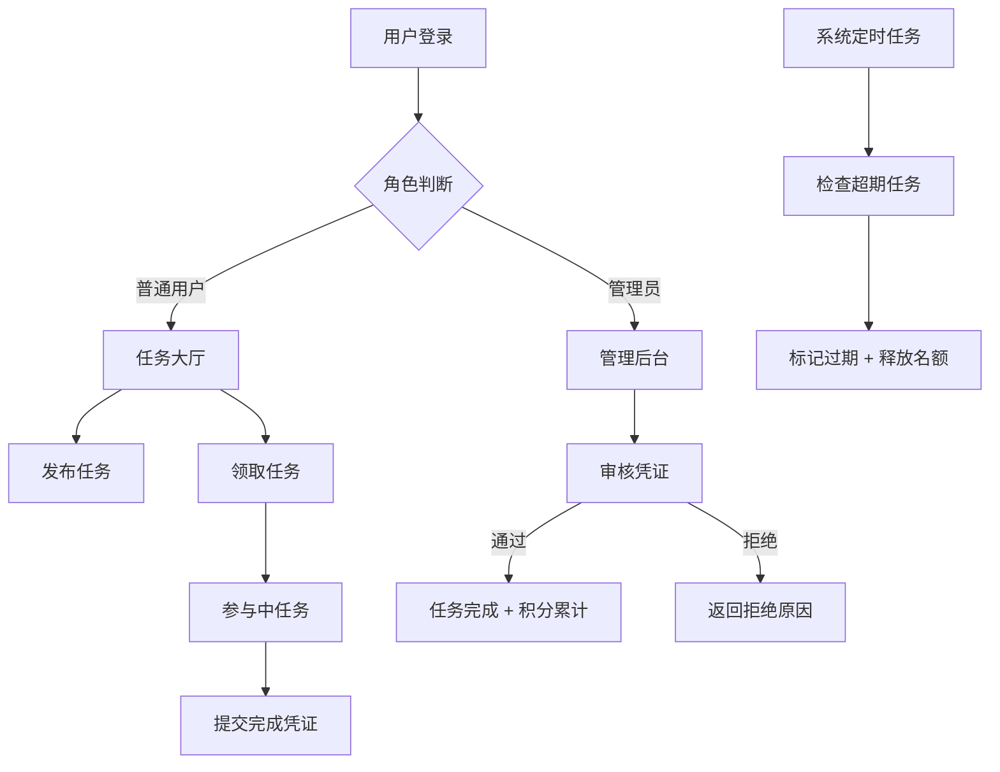

## 1. 产品概述

任务协作管理系统，支持普通用户与管理员双角色操作，实现任务发布、领取、审核、积分管理全流程。

- 主要目的：提供一个高效的任务协作平台，让用户发布和参与任务，管理员审核完成情况
- 解决问题：任务协作缺乏规范化管理、任务状态不透明、积分激励机制缺失
- 目标用户：需要协作完成任务的普通用户和负责审核管理的管理员

## 2. 核心功能

### 2.1 用户角色

| 角色 | 注册方式 | 核心权限 |
|------|----------|----------|
| 普通用户 | 账号注册 | 发布任务、浏览任务、申请加入任务、提交完成凭证、查看积分 |
| 管理员 | 预设账号 | 审核完成凭证、标记任务完成、管理任务状态、查看所有用户 |

### 2.2 功能模块

1. **登录/注册页**：用户登录、角色选择、账号注册
2. **首页/任务大厅**：任务列表展示、任务筛选、任务详情查看
3. **发布任务页**：任务标题、描述、截止日期、所需人数表单
4. **我的任务页**：已发布任务、已参与任务、任务状态跟踪
5. **管理后台（管理员）**：待审核凭证列表、审核操作、用户积分管理

### 2.3 页面详情

| 页面名称 | 模块名称 | 功能描述 |
|----------|----------|----------|
| 登录页 | 登录表单 | 用户名、密码输入，角色选择，登录校验 |
| 登录页 | 注册入口 | 跳转注册表单，新用户注册 |
| 任务大厅 | 任务列表 | 展示所有待领取任务卡片，支持筛选 |
| 任务大厅 | 任务详情弹窗 | 显示任务完整信息、参与按钮、参与人列表 |
| 发布任务页 | 任务表单 | 标题、描述（10-200字校验）、截止日期（不早于当前）、所需人数 |
| 我的任务页 | 已发布任务 | 查看自己发布的任务及状态、审核完成凭证入口 |
| 我的任务页 | 已参与任务 | 查看参与中任务、提交完成凭证、限制最多3个未完成 |
| 管理后台 | 待审核列表 | 展示所有待审核的完成凭证 |
| 管理后台 | 审核操作 | 通过/拒绝凭证、输入拒绝原因、积分累计 |

## 3. 核心流程

### 3.1 任务发布流程
用户登录后进入发布任务页面，填写任务表单（标题、描述、截止日期、所需人数），系统校验字段有效性（描述字数、日期有效性），校验通过后发布成功，任务进入"待领取"状态。

### 3.2 任务领取流程
用户在任务大厅浏览待领取任务，查看详情后点击"申请加入"，系统校验用户当前未完成任务数量是否≤2，校验通过后用户加入任务，任务已参与人数+1。

### 3.3 任务完成审核流程
用户完成任务后提交完成凭证，管理员在管理后台查看待审核凭证，审核通过后任务标记"已完成"，参与用户获得积分；审核拒绝则返回拒绝原因。

### 3.4 任务自动过期流程
系统每天凌晨自动扫描所有未完成任务，检查截止日期是否早于当前时间，将过期任务状态改为"已过期"，释放用户占用的参与名额。

## 4. 用户界面设计

### 4.1 设计风格
- **主色调**：深靛蓝 (#1e3a5f) 搭配活力橙 (#ff6b35) 作为强调色
- **辅助色**：中灰蓝 (#4a6fa5)、浅灰 (#f5f7fa)、警示红 (#e63946)
- **按钮风格**：圆角矩形 (8px)，主按钮有悬停上浮效果，禁用状态灰色
- **字体**：标题使用 "Noto Serif SC" 衬线体，正文使用 "Noto Sans SC" 无衬线体
- **布局风格**：卡片式布局，顶部导航栏，左侧边栏菜单
- **图标风格**：线性图标，统一 1px 描边，圆润端点

### 4.2 页面设计概览

| 页面名称 | 模块名称 | UI元素 |
|----------|----------|----------|
| 登录页 | 登录卡片 | 居中卡片布局，渐变背景，表单输入带浮动标签 |
| 任务大厅 | 任务卡片网格 | 响应式网格布局，任务卡片悬停上浮，状态标签颜色区分 |
| 发布任务页 | 表单区域 | 分组表单，实时字数统计，日期选择器，错误提示红色边框+红色文字 |
| 我的任务页 | 标签页切换 | 标签页导航，任务状态时间轴 |
| 管理后台 | 审核列表 | 表格布局，行悬浮高亮，审核操作按钮组 |

### 4.3 响应式设计
- 桌面端优先设计 (1280px+)
- 平板端 (768px-1279px)：侧边栏收起为图标菜单，卡片列数减少
- 移动端 (<768px)：顶部导航折叠为汉堡菜单，卡片单列布局

### 4.4 交互动效
- 页面加载：元素渐入 + 轻微上浮动画，使用 staggered 延迟
- 表单错误：红色边框脉动，错误提示滑入
- 任务卡片：悬停时轻微上浮 (translateY -4px) + 阴影加深
- 按钮点击：缩放 0.97 的按压反馈
- 状态变更：Toast 通知从顶部滑入
