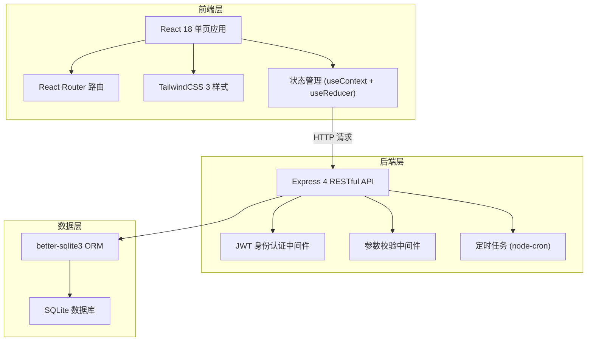
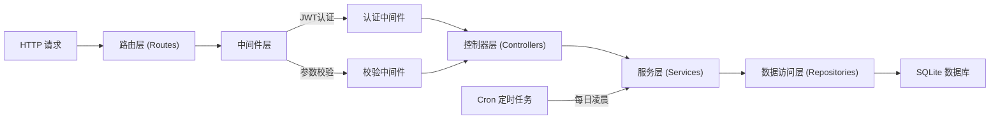
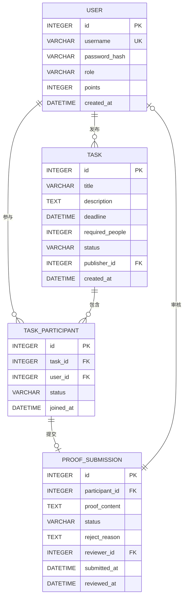

## 1. 架构设计



## 2. 技术描述

- **前端**：React@18 + React Router@6 + TailwindCSS@3 + Vite@5
- **初始化工具**：Vite (npm create vite@latest)
- **后端**：Express@4 + JWT认证 + node-cron定时任务
- **数据库**：SQLite (better-sqlite3驱动)
- **表单校验**：前端使用自定义hooks，后端使用 express-validator
- **日期处理**：dayjs

## 3. 路由定义

| 路由路径 | 页面组件 | 权限 | 用途 |
|----------|----------|------|------|
| /login | LoginPage | 公开 | 用户登录/注册 |
| / | TaskHallPage | 登录用户 | 任务大厅，浏览所有任务 |
| /tasks/publish | PublishTaskPage | 普通用户 | 发布新任务 |
| /tasks/mine | MyTasksPage | 登录用户 | 我的任务（发布/参与） |
| /admin | AdminDashboardPage | 管理员 | 管理后台，审核凭证 |

## 4. API 定义

### 4.1 认证接口
```typescript
// POST /api/auth/register
interface RegisterRequest {
  username: string;
  password: string;
  role: 'user' | 'admin';
}
interface AuthResponse {
  token: string;
  user: { id: number; username: string; role: string; points: number };
}

// POST /api/auth/login
interface LoginRequest {
  username: string;
  password: string;
}
```

### 4.2 任务接口
```typescript
// GET /api/tasks - 获取任务列表
// 支持 query: status, page, pageSize

// POST /api/tasks - 发布任务
interface CreateTaskRequest {
  title: string;
  description: string;  // 10-200字
  deadline: string;     // ISO日期字符串，不早于当前
  requiredPeople: number;
}

// POST /api/tasks/:id/join - 申请加入任务
// POST /api/tasks/:id/submit - 提交完成凭证
interface SubmitProofRequest {
  proof: string;  // 完成凭证说明
}

// GET /api/tasks/mine - 获取我的任务（发布/参与）
```

### 4.3 管理员接口
```typescript
// GET /api/admin/proofs - 获取待审核凭证列表

// POST /api/admin/proofs/:id/review
interface ReviewProofRequest {
  approved: boolean;
  rejectReason?: string;
  points?: number;  // 审核通过时的积分
}
```

### 4.4 统一响应格式
```typescript
interface ApiResponse<T> {
  success: boolean;
  data?: T;
  message?: string;
  errors?: { field: string; message: string }[];
}
```

## 5. 服务端架构图



## 6. 数据模型

### 6.1 ER 图



### 6.2 DDL 语句

```sql
-- 用户表
CREATE TABLE IF NOT EXISTS users (
  id INTEGER PRIMARY KEY AUTOINCREMENT,
  username VARCHAR(50) UNIQUE NOT NULL,
  password_hash VARCHAR(255) NOT NULL,
  role VARCHAR(20) NOT NULL DEFAULT 'user',
  points INTEGER NOT NULL DEFAULT 0,
  created_at DATETIME DEFAULT CURRENT_TIMESTAMP
);

-- 任务表
CREATE TABLE IF NOT EXISTS tasks (
  id INTEGER PRIMARY KEY AUTOINCREMENT,
  title VARCHAR(100) NOT NULL,
  description TEXT NOT NULL,
  deadline DATETIME NOT NULL,
  required_people INTEGER NOT NULL,
  status VARCHAR(20) NOT NULL DEFAULT 'open',
  publisher_id INTEGER NOT NULL,
  created_at DATETIME DEFAULT CURRENT_TIMESTAMP,
  FOREIGN KEY (publisher_id) REFERENCES users(id)
);

-- 任务参与表
CREATE TABLE IF NOT EXISTS task_participants (
  id INTEGER PRIMARY KEY AUTOINCREMENT,
  task_id INTEGER NOT NULL,
  user_id INTEGER NOT NULL,
  status VARCHAR(20) NOT NULL DEFAULT 'joined',
  joined_at DATETIME DEFAULT CURRENT_TIMESTAMP,
  FOREIGN KEY (task_id) REFERENCES tasks(id),
  FOREIGN KEY (user_id) REFERENCES users(id),
  UNIQUE (task_id, user_id)
);

-- 凭证提交表
CREATE TABLE IF NOT EXISTS proof_submissions (
  id INTEGER PRIMARY KEY AUTOINCREMENT,
  participant_id INTEGER NOT NULL,
  proof_content TEXT NOT NULL,
  status VARCHAR(20) NOT NULL DEFAULT 'pending',
  reject_reason TEXT,
  reviewer_id INTEGER,
  submitted_at DATETIME DEFAULT CURRENT_TIMESTAMP,
  reviewed_at DATETIME,
  FOREIGN KEY (participant_id) REFERENCES task_participants(id),
  FOREIGN KEY (reviewer_id) REFERENCES users(id)
);

-- 索引
CREATE INDEX IF NOT EXISTS idx_tasks_status ON tasks(status);
CREATE INDEX IF NOT EXISTS idx_tasks_deadline ON tasks(deadline);
CREATE INDEX IF NOT EXISTS idx_participants_user ON task_participants(user_id, status);
CREATE INDEX IF NOT EXISTS idx_proofs_status ON proof_submissions(status);

-- 默认管理员账号 (密码: admin123)
INSERT OR IGNORE INTO users (username, password_hash, role, points)
VALUES ('admin', '$2b$10$default_admin_hash_placeholder', 'admin', 0);
```
